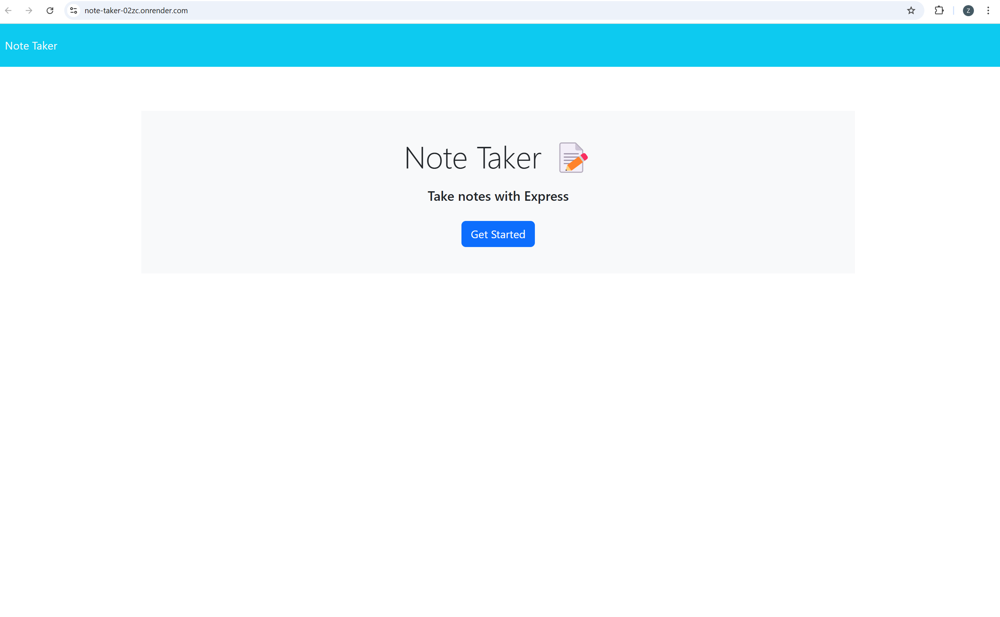
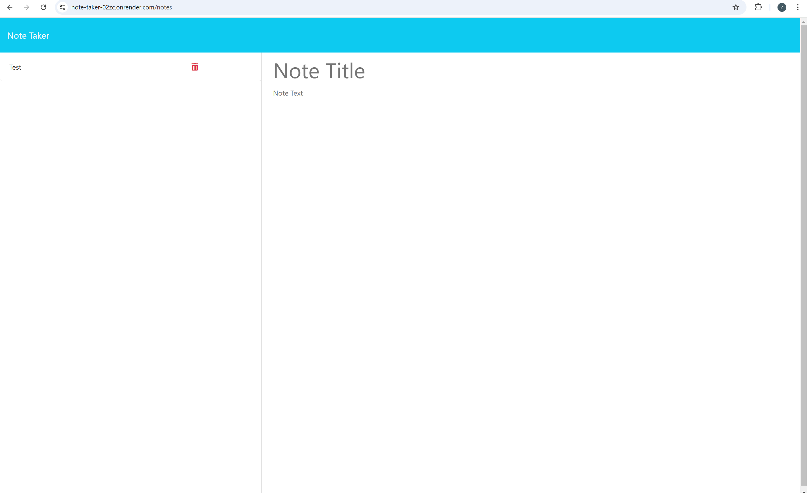

Note Taker

  

## Description
    
    This app allows you to take notes and store them to a local database and delete notes when you are finshed with them

## Table of Contents (Optional)
        
- [Installation](#installation)
- [Usage](#usage)
- [License](#license)
    
## Installation
    
    run npm install in the terminal to install the rquired npm packages    

## Usage
    
    run node server.js in the terminal which will host the site to the local port 3001, once navigated to the page you will come to a landing page press the get started button to go to the notes page where you can type a title and body for you note press the submit button and it is saved, you can then press the red trashcan next to the note to delete it.

Landing Page

Note Page

## License
    
    MIT    

## Questions

    https://github.com/Zakary575

    If you have any additional questions please contact me at Zakary.johnson575@gmail.com
    